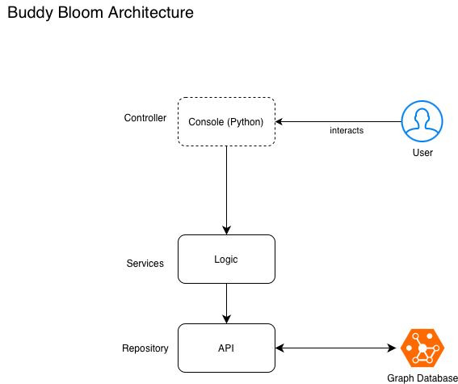

# buddy-bloom

---

# Overview
In this project, your team will design and develop a basic social networking application using Java (or Python) for the front end and Neo4j as the database. The system will model relationships between users, enabling social interactions such as following others, recommending connections, and efficiently querying networks using graph-based techniques. This project will give your team hands-on experience with graph databases, Java (Python)-based front-end development, and working with real-world datasets. This team project is separate from individual tasks, meaning it will have its own data modeling, use cases, and dataset, independent of those used in individual assignments.

--- 

# Use Cases
- Front-End: Implemented in Java (or Python), providing an interactive interface for users to explore the social network. The console interface is sufficient.
- Back-End: Built using Neo4j, a graph database optimized for relationship-heavy data.
- Data Source and Size: The application should utilize a public dataset (e.g., datasets from SNAP, Kaggle, or other open data repositories) to populate the social network. - The required dataset size is at least 1,000 nodes and 5,000 relationships. If your chosen public dataset is smaller than this, you may expand it by generating additional synthetic data to meet the recommended size.
-The following 11 Use Cases:

## 1 User Management

1. User Registration: A new user can sign up by providing basic details (name, email, username, password). The system stores user data in Neo4j as nodes.
2. User Login: A registered user can log in using their username and password. The system authenticates the credentials and grants access.
3. View Profile: A user can view their own profile and update basic information.
4. Edit Profile: A user can update their name, bio, and other details.

## 2 Social Graph Features

5. Follow Another User - A user can follow another user, creating a "FOLLOWS" relationship in Neo4j. The relationship is stored as an edge in the graph database.

6. Unfollow a User - A user can unfollow another user, removing the "FOLLOWS" relationship.

7. View Friends/Connections - A user can see a list of people they are following and who follow them.

8. Mutual Connections - A user can see mutual friends (users followed by both parties).

9. Friend Recommendations - The system suggests new people to follow based on common connections using graph traversal queries.

## 3 Search & Exploration

10. Search Users - A user can search for other users by name or username. The system returns a list of matching users.

11. Explore Popular Users - The system displays the most-followed users.

---

# Requirements

Python 3.13

uv (Python Package Manager) : https://docs.astral.sh/uv/getting-started/installation/

Neo4j AuraDB

---

# Architecture

**Model**: 
Represents the data and its associated business rules. This can include:
- Domain Objects/Entities: Plain objects representing the core data structure (e.g., User, Product). These are often mapped to database tables.
- Data Transfer Objects (DTOs): Objects used for transferring data between layers, often tailored for specific views or API responses.

**Repository**: Acts as an abstraction layer for data access. Its responsibilities include:
- Providing methods for CRUD (Create, Read, Update, Delete) operations on specific data entities.
- Abstracting the underlying data storage mechanism (e.g., a database, a file system).
- Often interacting with ORMs (Object-Relational Mappers)

**Service**: Contains the core business logic of the application. Its responsibilities include:

- Implementing complex business rules and workflows.
- Performing data validation and transformation before passing data to repositories or controllers.
- Ensuring transactional integrity for operations spanning multiple data changes.

**Controller**: Handles incoming requests from the user and prepares responses. Its responsibilities include:
- Receiving and validating input from requests.
- Delegating business logic execution to the appropriate service.
- Mapping data from the service layer to suitable view models or DTOs for presentation.
- Returning responses to the client, often in formats like JSON.

